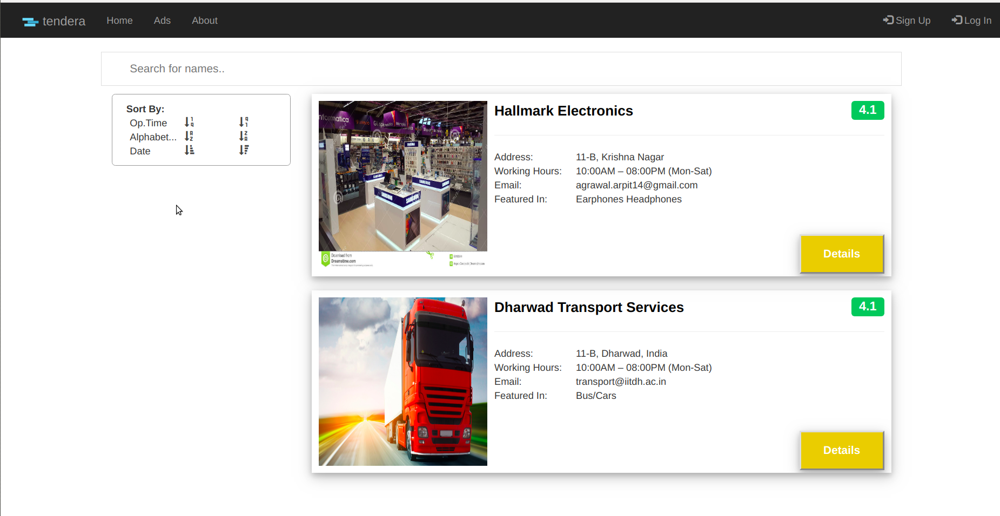

## Tendera

We plan to assist businesses and organizations by providing a portal to post tenders and requirements. These requirements are tracked by dealers/businesses all over the world which in turn provide a quotation to take up the task. It helps to outsource services such as a requirement of “personnel’s to guard the premises”, “a cleaning staff” etc. and product requirements such as “computers and laptops”, “construction materials” etc.

### Setup

Click [here](https://github.com/akshatkarani/Tenders/blob/master/requirements.md) to see instructions for installation.

